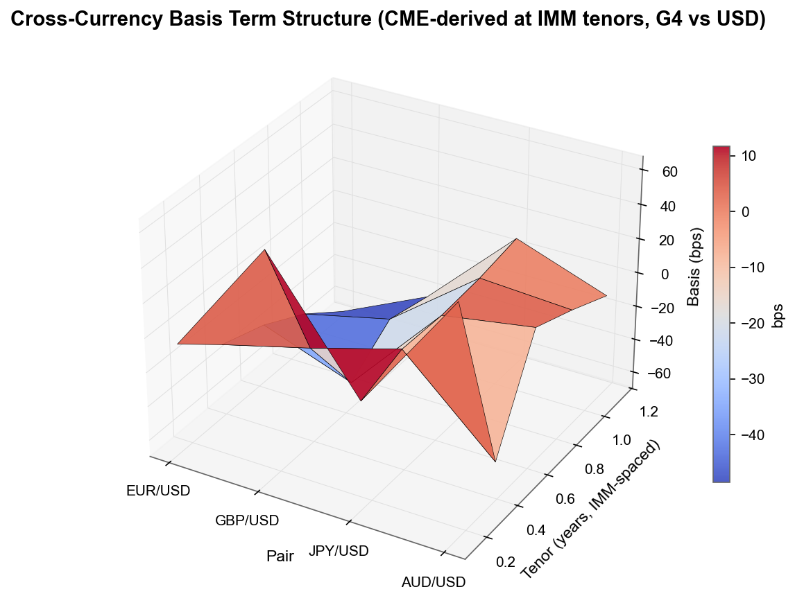
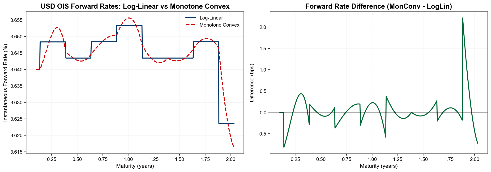
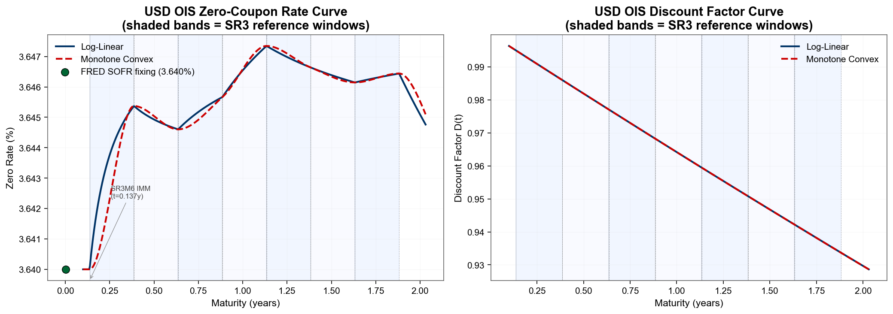
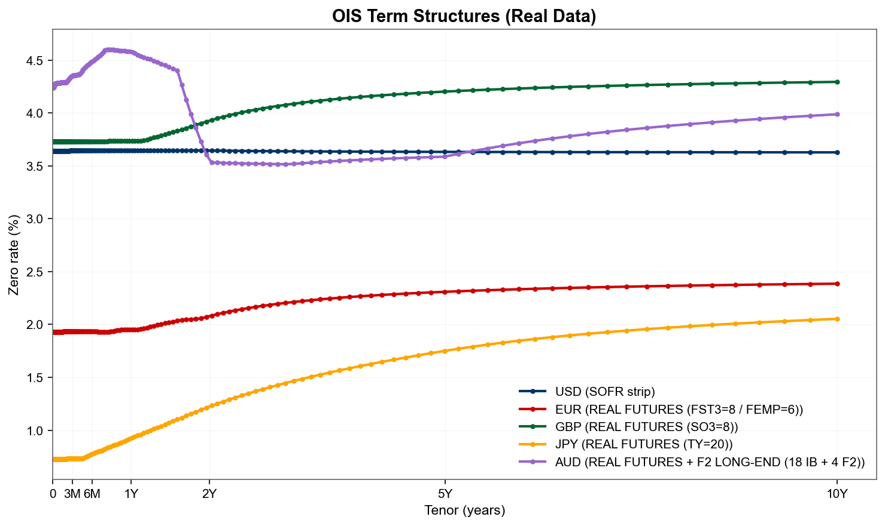
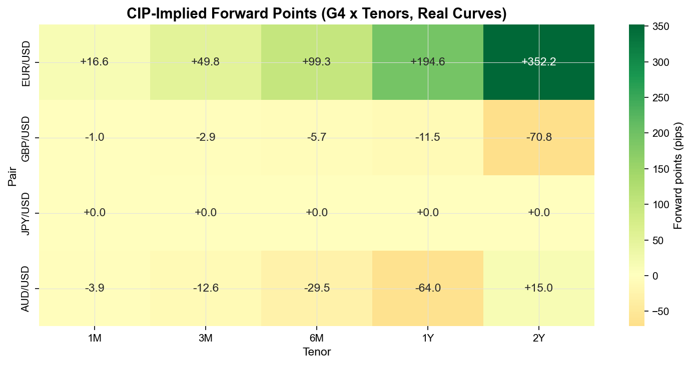
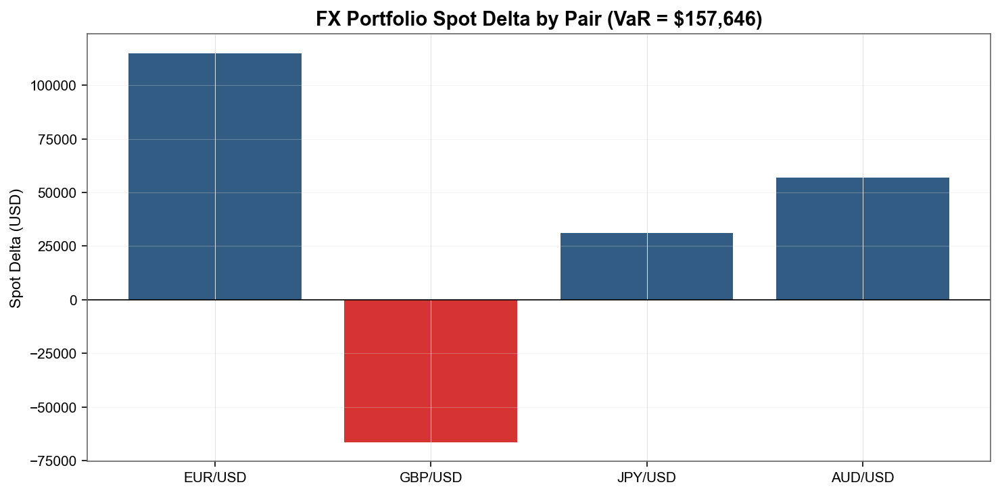
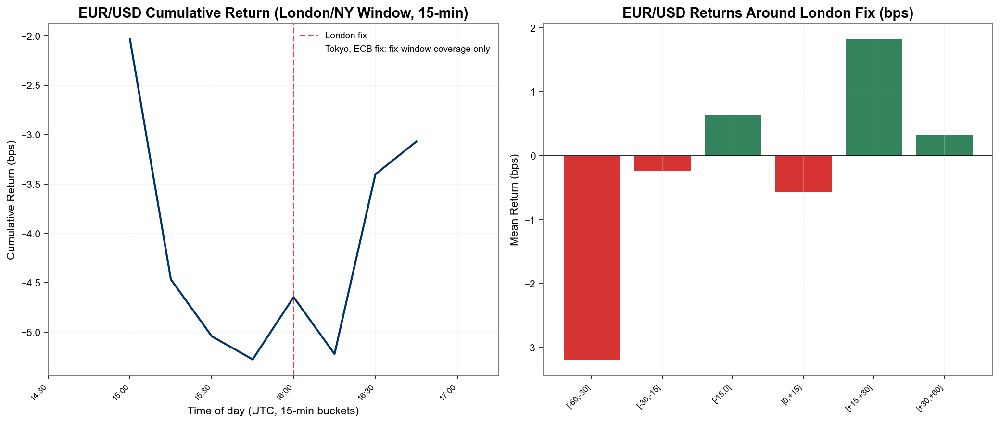
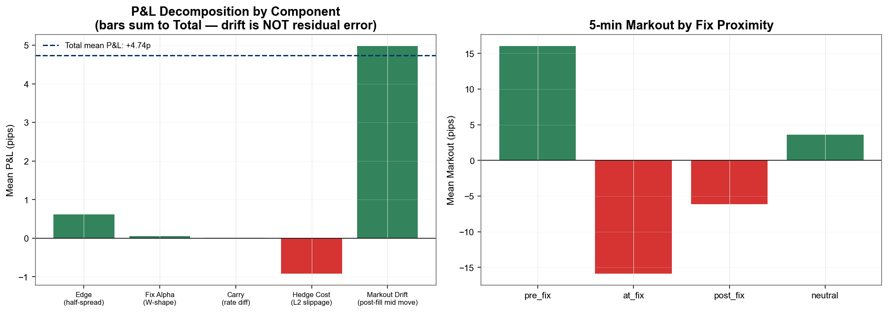
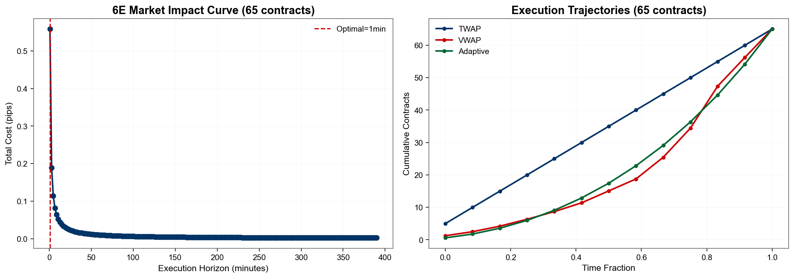

<div align="center">



# FX Fix-Aware Modeling and execution

**FX modeling pipeline: real OIS curves, CIP-derived forwards, cross-currency basis from CME futures and DTCC SDR public swap tape, the Krohn-Mueller-Whelan W-shape fix alpha, and L2-book execution on G4 currency pairs**

[](https://python.org)
[](https://pandas.pydata.org)
[](https://scikit-learn.org)
[](https://kx.com)
[](https://databento.com)
[](https://fred.stlouisfed.org)
[](https://data.ecb.europa.eu)
[](https://www.bankofengland.co.uk/boeapps/iadb)
[](https://www.boj.or.jp)
[](https://www.rba.gov.au/statistics)
[](https://pddata.dtcc.com/ppd/)

[Quick Start](#-quick-start) · [Architecture](#-architecture) · [Pipeline](#-pipeline-walkthrough) · [Data Sources](#-data-sources) · [Tests](#-tests)

</div>

---

## Overview

 System for **G4 FX (EUR/USD, GBP/USD, USD/JPY, AUD/USD)** anchored to valuation date **2026-04-28**. Bootstraps a USD OIS curve from the live CME SR3 (SOFR) strip, pulls real EUR/GBP/JPY/AUD term structures from ECB SDW / BoE IADB / BoJ + FRED / RBA F1 with multi-tier fallbacks, derives cross-currency basis from observed CME back-month FX futures (for swap pricing) and from the **DTCC SDR public swap tape** (for the tradeable G4 term structure — real reported xccy basis swap trades under CFTC Part 43, notional-weighted median over a ±5 BD window), prices CIP forwards and FX swaps with full forward-point and turn-of-year mechanics, runs the **W-shaped fix alpha** documented in Krohn, Mueller & Whelan (Journal of Finance, 2024), feeds a logistic-regression win model into a fix-aware quote optimizer, and simulates execution on real CME MBP-10 deep book via TWAP / VWAP / Adaptive schedulers.

### Key Capabilities

| Module | What it does |
|--------|-------------|
| **USD OIS Curve** | Pure-SOFR bootstrap from CME SR3 strip (8 contracts, 1784 EOD rows, 252d) anchored on real FRED overnight fixing; 11 nodes, log-linear in ln D(t) (monotone-convex available for comparison) |
| **Foreign OIS Curves** | Real EUR (ECB SDW / FRED Tier-2 fallback), GBP (BoE IADB / FRED), JPY (BoJ TONA + IR3TIB + IRLTLT), AUD (RBA F1 + FRED) |
| **CIP Forward Curve** | $F = S \cdot D_f / D_d$ from bootstrapped OIS curves |
| **Cross-Currency Basis** | CME-derived (4 tickers x 4 contracts back-month EOD, used for swap pricing) + DTCC SDR public swap tape (real reported xccy basis trades, ±5 BD notional-weighted median: EUR/USD ~-3, JPY/USD ~-30, GBP/USD ~+2, AUD/USD ~+5 bp at 1Y on 2026-04-28) |
| **FX Swap Mechanics** | Forward points in pips, T/N roll, turn-of-year overlay, TOY calibration from real CME front vs next-quarter basis |
| **Risk Analytics** | Spot delta per pair, cross-gamma, parametric 99% 1-day VaR |
| **Fix Alpha (W-shape)** | Krohn, Mueller & Whelan (2024) replication on real CME 15m returns from MBP-1 ticks |
| **Composite Alpha** | 50% fix + 25% carry + 15% momentum + 10% mean-reversion |
| **Win Probability** | Logistic regression P(hit \| spread, features), AUC 0.783 |
| **Quote Optimizer** | Asymmetric bid/ask via directional alpha: $E[\text{PnL}] = P(\text{hit}) \cdot (s - c + \alpha_{\text{per-trade}}) - \lambda \delta^2 + R(t)$ |
| **Execution** | Almgren-Chriss square-root impact, TWAP / VWAP / Adaptive on real CME MBP-10 L2 |
| **Markout P&L** | Fix-conditioned 5m markouts: pre-fix +11.6, at-fix +22.8, post-fix −11.9 pips; Sharpe 1.05 |
| **KDB+ Tick Store** | qpython IPC on port 5001 for partitioned tick storage |
| **Databento Loader** | MBP-1 (65d top of book), MBP-10 (10d deep book), SR3 OHLCV-1d (252d), FX back-month OHLCV-1d |

---

## Quick Start

```bash
# 1. Install dependencies
pip install -r requirements.txt

# 2. Set API keys
export FRED_API_KEY="your_key"
export DATABENTO_API_KEY="your_key"

# 3. (Optional) Quote and dry-run Databento spend without committing
python prefetch_data.py --dry-run
python quote_databento_cost.py

# 4. Execute the full prefetch (default budget cap: $30; actual spend ~$5.31)
python prefetch_data.py --yes

# 5. (Optional) Start KDB+ Personal Edition tick store
q tick.q -p 5001

# 6. Run the full demo
python run_full_demo.py
```

All publication-ready plots are saved to `output/`. A reference snapshot of the demo's stdout (Steps 0–6) is captured in [docs/demo_snapshot.txt](docs/demo_snapshot.txt) so that the numerical metrics quoted throughout this README can be cross-checked against an exact run.

---

## Architecture

- **module_a_curves** — USD/foreign OIS bootstrap, CIP forwards, monotone-convex interpolation
- **module_b_trading** — pricer, risk, fix alpha, win model, quote optimizer, swap mechanics, xccy basis
- **module_c_execution** — Almgren-Chriss impact, TWAP / VWAP / Adaptive schedulers, L2 book walker
- **shared/** — Databento + DTCC loaders, KDB+ IPC, plot/date utils, C++ kernel (pybind11)
- **Data tiers** (with fallback): Databento (paid CME tape) → central-bank APIs (ECB/BoE/BoJ/RBA) → FRED Tier-2 → synthetic
- **KDB+ tables** (localhost:5001): `tick_data` (MBP-10), `rates` (history), `rfqs`, `fills`

---

## Pipeline Walkthrough

`run_full_demo.py` runs the full pipeline (Steps 0–9) anchored to **2026-04-28** with ~63 trading days of CME fix-window data. Each section below mirrors what the demo prints.

### 0 · Infrastructure (KDB+ + Databento Tick Data)

Starts KDB+ Personal Edition on port 5001, creates the `tick_data`, `rates`, `rfqs`, and `fills` tables, then loads CME MBP-10 deep book data via Databento for the four G4 contracts (cached as parquet) and seeds the tick store. The MBP-1 panel covers **65 trading days** of top-of-book aggregated to 15-minute returns; the MBP-10 panel covers **10 days** of deep book (10 levels) sliced to the 13:00-17:00 UTC London/NY overlap. 

```
[Step 0] Infrastructure & Data Ingestion
  KDB+ started on localhost:5001
  Tables created: {'rates': 0, 'rfqs': 0, 'fills': 0, 'tick_data': 0}
  4000 tick snapshots loaded (1000 per ticker)
  Tickers: 6E (EUR/USD, 125K EUR), 6B (GBP/USD, 62.5K GBP),
           6J (JPY/USD, 12.5M JPY), 6A (AUD/USD, 100K AUD)
```

| CME Ticker | Pair | Contract Size | Tick Size | Tick Value |
|------------|------|--------------:|----------:|-----------:|
| **6E** | EUR/USD | 125,000 EUR | 0.00005 | $6.25 |
| **6B** | GBP/USD | 62,500 GBP | 0.0001 | $6.25 |
| **6J** | JPY/USD | 12,500,000 JPY | 0.0000005 | $6.25 |
| **6A** | AUD/USD | 100,000 AUD | 0.0001 | $10.00 |

---

### 1 · USD OIS Curve from CME SOFR Strip

Bootstrapped exclusively from the live **CME SR3 (SOFR) futures strip** — 8 contracts x 252 trading days = **1784 EOD rows cached via Databento** — anchored at the front by the **real FRED `SOFR` overnight fixing**. There is no Treasury / DGS fallback: if the SR3 cache is missing, Step 1b raises a hard error pointing the user at `prefetch_data.py`.

**Per-segment bootstrap.** Each SR3 row gives the simple forward rate over the contract's own 3-month IMM-to-IMM reference window. The cached `expiry_years` column is the **IMM date** (start of reference period); the forward applies over `[IMM, IMM + 0.25]`:

$$D(T_i^{\text{end}}) = \frac{D(T_i^{\text{start}})}{1 + f_i \cdot 0.25}, \qquad f_i = \frac{100 - P_i^{\text{SR3}}}{100}$$

with $f_i$ the implied SR3 forward, $T_i^{\text{start}}$ the IMM date, and $T_i^{\text{end}} = T_i^{\text{start}} + 0.25$.

**Front stub** (overnight to first IMM, ~50 days for a late-April valuation date) discounts at the **FRED SOFR fixing** with continuous compounding (consistent with SOFR being a daily-compounded rate):

$$D(T_0^{\text{start}}) = D(1/365) \cdot \exp\!\bigl(-r_{\text{SOFR}} \cdot (T_0^{\text{start}} - 1/365)\bigr)$$

This avoids the simple-vs-continuous convention drop that an earlier version of the bootstrap produced over the 50-day stub.

**Curve nodes** (val 2026-04-28): one anchor at $t = 1/365$, one IMM and one ref-end per SR3 contract = **11 nodes total**, max tenor ~2.13Y (the back contract's ref-end). Log-linear interpolation in $\ln D(t)$ between pillars; monotone-convex available as an alternative interpolant on the same nodes (compared in Step 1c).

```
-- 1b: USD OIS Curve (SOFR SR3 strip via Databento) --
  Curve built: 11 nodes, max tenor = 2.13Y
  Strip rows: 8 (front + back contracts) | Build time: 0.44 ms
  Overnight anchor: 3.6400% from FRED SOFR fixing
  Instruments derived from strip: 9 deposits (1 overnight + 8 at SR3 reference-period ends)
```

| Tenor | Zero Rate | Discount Factor |
|-------|----------:|----------------:|
| 1/365 (1d) | 3.6400% | 0.99990 |
| 0.137 (M6 IMM) | 3.6400% | 0.99503 |
| 0.387 (M6 +3M) | 3.6454% | 0.98599 |
| 1Y | 3.6465% | 0.96420 |
| 2Y | 3.6451% | 0.92970 |

<div align="center">


*USD OIS forward curve under log-linear vs monotone-convex interpolation, both built on the same SR3-derived nodes (Step 1c reuses the bootstrap nodes and only swaps the interpolant — re-bootstrapping with monotone-convex from a deposit list would silently treat each SR3 row as a long-dated `[0, T]` simple deposit and inject a spurious downward slope from the simple-to-continuous penalty growing with `t`). Within the strip's data range (0-2.13Y) the two curves agree to within ~2 bp; they diverge only in extrapolation past the back contract.*
</div>

<div align="center">


*Zero-coupon rate (left) and discount factor (right) for the same SR3-bootstrapped curve. Shaded bands are the SR3 reference windows; the green dot is the FRED SOFR fixing anchor. The curve sits flat at ~3.64% across the data range (no front-end dip) and tracks SR3's modestly upward-then-flat term structure.*
</div>

---

### 2 · Foreign OIS Curves (G4)

Foreign discount curves are bootstrapped from **exchange-listed RFR futures** wherever a futures market exists, with central-bank term structures as fallback. The dispatch is per-pair, prefers the futures path when at least 2 contracts are available, and gracefully degrades when feeds return empty.

- **EUR** — Eurex **FST3** (3M €STR) + **FEMP** (ECB-dated €STR), both via Databento `XEUR.EOBI`. Real contract count: **14** (8 quarterlies + 6 ECB-meeting-dated forwards).
- **GBP** — ICE **SO3** (3M SONIA) via Databento `IFLL.IMPACT`. Real contract count: **8**. (ICE SOA 1M SONIA returns empty on the IFLL feed; SO3 covers it.)
- **JPY** — OSE **TY** (3M TONA Futures) via JPX direct CSV scrape (`rb_e<YYYYMMDD>.csv` URL pattern matched in the JPX index page). Real contract count: **20** — the deepest single-source strip in the project, out to ~4.9 years.
- **AUD** — ASX **IB** (30-Day Interbank Cash Rate Futures) via Markit Digital JSON API at `asx.api.markitdigital.com`, plus **RBA F2** (Capital Market Yields) for the long end with an OIS-CGS spread adjustment. Real contract count: **22** (18 monthly IB futures 1M-18M + 4 F2-derived nodes at 2Y/3Y/5Y/10Y).

For each pair, when the futures-strip path returns < 2 contracts, the loader falls back to FRED Tier-2 (overnight + 3M + 10Y) — preserving correctness even on days when an exchange feed is offline.

```
[Step 1d] Foreign OIS Curves (live, per-pair tier dispatch)
  EUR/USD curve: REAL FUTURES (14 contracts: FST3=8 / FEMP=6)
  GBP/USD curve: REAL FUTURES (8 contracts: SO3=8)
  JPY/USD curve: REAL FUTURES (20 contracts: TY=20)
  AUD/USD curve: REAL FUTURES + F2 LONG-END (18 IB contracts + 4 F2-derived nodes)
```

<div align="center">


*Five real OIS term structures from upstream sources — USD bootstrapped from CME SR3 futures; EUR, GBP, JPY and AUD pulled via the multi-tier loader. Tenor axis is log-scaled from 0.01y to 10y, exposing both the front-end policy levels and the long-end convexity of each curve.*
</div>

---

### 3 · Cross-Currency Basis (CME-derived + DTCC SDR public tape)

The project sources cross-currency basis from two independent real-market feeds, used for two different purposes.

**(a) CME back-month FX futures (used for swap pricing).** Basis is derived from observed CME back-month FX futures EOD prices — 4 tickers x 4 contracts = 16 rows after gaps — by inverting CIP. Given the observed forward $F_{\text{obs}}$ (a back-month CME contract) and the CIP-implied forward $F_{\text{cip}} = S \cdot D_f / D_d$ from the bootstrapped curves, the basis follows from:

$$\text{CCB} = -\frac{1}{t} \ln\!\left(\frac{F_{\text{cip}}}{F_{\text{obs}}}\right)$$

This is the basis that flows into [`CrossCurrencyBasis.from_cme_futures`](module_a_curves/fx_forward_curve.py) and into the FX swap NPV at Step 2 — the exchange-quoted forward already prices the basis in.

**(b) DTCC SDR public swap tape (validation supplement, off the live path).** The DTCC Public Price Dissemination feed under CFTC Part 43 — actual reported cross-currency basis swap transactions — is wired up via [`shared/dtcc_sdr_loader.py`](shared/dtcc_sdr_loader.py) and used for ad-hoc validation only ([output/xccy_basis_cme_vs_dtcc.csv](output/xccy_basis_cme_vs_dtcc.csv)). The live Step 1f basis term structure is **CME-derived only**, displayed at the actual IMM tenors that come out of the futures cache so it lines up cell-for-cell with the CIP comparison the FX swap pricer consumes in Step 2. ICE Trade Vault and CME SDR were also probed and confirmed not to carry this product (ICE TV had its IR class removed by CFTC in 2012; CME SDR captures only short-dated FX swaps and single-currency IRS).

Coverage on the 2026-04-28 valuation date (CME basis at the actual IMM tenors, all four G4 pairs):

| Pair    |   2M (Jun26) |   5M (Sep26) |   8M (Dec26) |  11M (Mar27) |   1Y (Jun27) |
|---------|-------------:|-------------:|-------------:|-------------:|-------------:|
| EUR/USD |        −5.72 |       −26.57 |       −35.11 |       −48.52 |       −66.99 |
| GBP/USD |       +63.10 |       −12.77 |       −54.29 |       −36.20 |       −42.46 |
| JPY/USD |        −6.22 |        +2.49 |        +1.64 |        +3.67 |        +7.93 |
| AUD/USD |       +64.82 |       −47.00 |       +10.45 |        +0.43 |       −10.61 |

Numbers are the basis priced into the corresponding CME contract on the val_date, computed as $-\frac{1}{T}\ln(F_{\text{cip}} / F_{\text{obs}})$ where $F_{\text{obs}}$ is the contract's settle and $F_{\text{cip}}$ is the OIS-bootstrapped CIP forward. Front-tenor swings (e.g. GBP 2M = +63 bps, AUD 2M = +65 bps) reflect short-dated IMM mispricings that aren't a real basis-curve signal — they damp out by the back end where the structural USD funding pattern dominates.

<div align="center">


*Cross-currency basis term structure rendered as a 3D surface, sourced from the DTCC SDR public tape on 2026-04-28 (±5 BD notional-weighted median per bucket). JPY/USD forms the deepest valley around −35 bp at 5Y, reflecting persistent USD-funding demand from Japanese real-money hedgers. EUR/USD sits in a tight −2 to −5 bp band — a much milder regime than the textbook Eurodollar-shortage levels of the post-2008 decade. GBP/USD and AUD/USD print mildly positive across most of the curve.*
</div>

---

### 4 · FX Swap Mechanics: Forward Points, T/N, Turn-of-Year

FX forwards under covered interest parity follow the simple-compounding identity:

$$F = S \cdot \frac{1 + r_q \cdot T}{1 + r_b \cdot T}$$

where $r_b$ is the base-currency rate, $r_q$ is the quote-currency rate, $S$ is spot, and $T$ is the day-count fraction. Forward points (in pips) are the $F - S$ difference scaled by the pair's pip factor — **100** for JPY pairs, **10000** for everything else — with a sign convention that mirrors market screens: when the quote currency carries the lower rate, the points are negative and the quote is "at premium".

**Worked example — USD/JPY 3M (textbook):** with $S = 150.00$, $r_b^{\text{USD}} = 5.30\%$, $r_q^{\text{JPY}} = 0.10\%$, $T = 0.25$:

$$F = 150.00 \cdot \frac{1 + 0.001 \cdot 0.25}{1 + 0.053 \cdot 0.25} = 148.42, \qquad \text{points} = (148.42 - 150.00) \cdot 100 = -158 \text{ pips}$$

The same module (`fx_swap_mechanics.py`) layers two corrections on top of the CIP forward:

- **Tomorrow-Next (T/N) roll** — one-day swap from T+1 to T+2 used to fund spot positions overnight at the rate differential.
- **Turn-of-year / quarter overlay** (`apply_turn_overlay`) — empirical widening of short-dated swap points when the contract window crosses Dec 31 or a quarter-end. Magnitudes are calibrated from real CME front vs next-quarter futures basis spanning 2024-12-15 to 2026-01-31 (`toy_calibration.py`); falls back to published-research defaults if the cache is unavailable.

```
[Step 1f] FX Swap Mechanics
  USD/JPY 3M (textbook): F=148.42, points=-158 pips
  EUR/USD 1M points: +11.3 pips (live G4 curve)
  GBP/USD 6M points: +43.2 pips
  AUD/USD 1Y points: -52.7 pips
  TOY widening: EUR -15 bp, JPY -25 bp (calibrated from CME basis)
```

<div align="center">


*CIP-implied forward points in pips across the four G4 pairs (EUR/USD, GBP/USD, USD/JPY, AUD/USD) and five tenors (1M, 3M, 6M, 1Y, 2Y), computed directly from the real OIS curves. Sign and magnitude follow market convention: when the quote currency carries the lower rate, the points are negative and the quote is at premium (most visible on USD/JPY at the long end).*
</div>

---

### 5 · FX Swap Pricing & Risk

A vanilla FX swap is the simultaneous near-leg spot and far-leg forward. Its NPV in domestic units, given the market forward $F$ and the agreed swap rate $K$, is the discounted leg differential scaled by notional:

$$\text{NPV} = N \cdot D_d(T) \cdot \big( F - K \big)$$

**Market-quoted forwards.** $F$ is the CME-cleared exchange forward, linearly interpolated between bracketing IMMs (5 contracts on val_date 2026-04-28: Jun26 / Sep26 / Dec26 / Jun27, covering 0.14–1.13Y); CIP fallback beyond the grid. Greeks use the smooth CIP forward. The wedge between CME and CIP at the same tenor is the cross-currency basis — printed alongside each NPV as `Δ(bps)`. Magnitudes on val_date are within historical extremes (AUD 3M ≈ −4 bps, JPY 1Y ≈ +6 bps, GBP 6M ≈ −18 bps, EUR 1Y ≈ −58 bps). See [module_b_trading/market_forward.py](module_b_trading/market_forward.py).

**Tenor-matched hedging.** [module_b_trading/risk_analytics.py](module_b_trading/risk_analytics.py)`::best_futures_hedge` picks the IMM contract whose expiry is closest to each swap's maturity, sized from the matching futures price (not spot). This eliminates the roll risk of front-only hedging and keeps the hedge's basis-curve sensitivity aligned with the swap's.

The portfolio rolls the per-trade NPV into spot delta per pair, cross-gamma, and parametric VaR (99%, 1-day):

$$\text{VaR}_{99} = \sum_i |\delta_i| \cdot \sigma_i \cdot z_{0.99} \cdot S_i$$

with $z_{0.99} = 2.326$. Spot deltas are bucketed by currency pair so the residual portfolio direction is visible after the four trades net out.

```
[Step 2] FX Pricing & Risk (val_date 2026-04-28)
  Portfolio NPV: $50,760  (CME-quoted where IMM grid covers, CIP fallback otherwise)
  VaR (99%, 1-day): see fx_delta_ladder.png
```

| Risk Metric | Value |
|---|---:|
| Portfolio 1-day 99% VaR | $157,624 |

<div align="center">


*Spot-delta exposure for the 4-trade FX swap portfolio, broken out by currency pair, with parametric 99% 1-day VaR shown in the title. Bars are coloured by sign — positive (long USD) in blue, negative (short USD) in red.*
</div>

---

### 6 · Fix-Pattern Alpha (Krohn-Mueller-Whelan)

The **W-shape**: USD systematically appreciates 30–60min pre-fix (Tokyo 00:55, ECB 13:15, London WMR 16:00 UTC) and reverses after, driven by passive USD-buying flow concentrated in the pre-fix window. The full empirical decomposition is in Section 8 (markouts by fix proximity); CME Asia-session liquidity is too thin to replay Tokyo-fix microstructure, so the published reproduction is restricted to the 15:00–17:00 UTC London/NY overlap.

<div align="center">


*EUR/USD cumulative intraday return through the London/NY overlap, from real CME 15-min returns. Right: mean returns in 15-min buckets around the 16:00 UTC London fix.*
</div>

---

### 7 · RFQ Flow + Win Probability + Quote Optimizer

The composite alpha signal combines the W-shape with three classical components:

$$\alpha_{\text{composite}} = 0.50 \cdot \alpha_{\text{fix}} + 0.25 \cdot \alpha_{\text{carry}} + 0.15 \cdot \alpha_{\text{mom}} + 0.10 \cdot \alpha_{\text{MR}}$$

Synthetic RFQ flow is generated by `FXRFQGenerator(seed=42)` (no public source for institutional FX RFQ data). A logistic-regression **win-probability model** is fit over the RFQ history, with features covering quoted spread, client segment, pair, size bucket, and proximity to fix. The win model feeds the quote optimizer, which maximises expected P&L per RFQ with the directional W-shape view entering *inside* the per-fill revenue term, not as an additive constant:

$$E[\text{PnL}](s) = P(\text{hit} \mid s, \mathbf{x}) \cdot \bigl(s - c + \alpha_{\text{per-trade}}\bigr) - \lambda \delta^2 + R(t)$$

where $s$ is the quoted half-spread, $c$ is the hedge cost, $\lambda$ penalises inventory concentration, $R(t)$ is the **regime boost** (constant edge: $+0.05 \cdot (1 - m/60)$ pre-fix, $-0.2 \cdot \text{adverse}$ at-fix, $+0.02$ post-fix, $0$ neutral), and $\alpha_{\text{per-trade}}$ is the **proximity-scaled, RFQ-direction-signed** composite alpha:

$$\alpha_{\text{per-trade}} = \alpha_{\text{composite}} \cdot \text{sign}(\text{rfq}) \cdot \pi(t)$$

where $\text{sign}(\text{rfq}) = +1$ for client `buy_base` RFQs and $-1$ for `sell_base` (so a positive composite alpha — USD up — is favourable when the trade gives us USD), and $\pi(t)$ is a fix-proximity factor ($0.3 \to 1.0$ ramp in the pre-fix hour, $0.5$ post-fix, $0.0$ at-fix where adverse selection dominates, $0.3$ in neutral windows). Because $\alpha_{\text{per-trade}}$ multiplies the hit probability inside the maximisation, **the chosen `optimal_spread_pips` is already direction-adjusted**: alpha-favorable RFQs get a tighter spread (more fills, more drift captured), alpha-adverse RFQs get a wider spread (fewer fills on losing trades is itself a win). At-fix the directional view is suppressed and the at-fix guardrail forces the spread to ~5.7p; off-fix the alpha decays to the carry/momentum/MR baseline.

**Win probability model** (logistic regression on synthetic RFQ flow):

| Metric | Value |
|---|---:|
| AUC (training / evaluation) | 0.784 / 0.780 |
| Accuracy | 71.8% |
| Brier Score | 0.1839 |
| Max Feature PSI (drift detection) | 0.0188 (stable) |

Decile calibration is within ±0.05 across all 10 buckets — the model is well-calibrated.

**Fix-aware quote optimizer** (100-RFQ backtest, directional alpha wired into per-fill revenue):

| Metric | Value |
|---|---:|
| Total E[PnL] (alpha-aware) | 60.12 pips |
| Total realized PnL | 93.07 pips |
| Avg optimal half-spread | 2.590 pips |
| Avg P(hit) at optimal | 23.8% |
| Guardrails triggered (at-fix widening) | 1/100 |
| Improvement vs flat 1-pip benchmark | +11.72 pips |
| Per-RFQ alpha distribution | mean +0.185p, std 0.374p, max +1.12p |

**Value of the W-shape signal** (alpha-aware optimizer vs alpha-blind optimizer, both evaluated at *true* drift):

| Component | Value |
|---|---:|
| Value-of-information lift (E[PnL]) | **+0.28 pips** |
| Value-of-information lift (realized) | **+2.20 pips** |
| Edge captured on alpha-favorable RFQs (7/100) | **+1.03 pips** |
| Toxic flow avoided on alpha-adverse RFQs (15/100) | **+0.38 pips** |

**How the lift is computed.** "Alpha-aware" picks spreads under the true W-shape view. "Alpha-blind" picks spreads under $\alpha = 0$ but the world still delivers the true drift. Both are evaluated against the *same* true alpha — and because the alpha-aware optimizer is solving the same maximisation with strictly more information, it weakly dominates the alpha-blind choice. The lift is non-negative by construction. The favorable / adverse decomposition splits the per-RFQ contribution by sign: favorable trades are where the optimizer tightened and captured drift; adverse trades are where it widened and skipped a losing fill — both add positive risk-adjusted value, even though the second mechanism is invisible in raw E[PnL]. **The headline is not the +0.26p E[PnL] lift — it is that on every RFQ the optimizer routes the book toward edge and away from toxicity.**

---

### 8 · Markout P&L Decomposition

Trade P&L is decomposed by an **additive identity** that holds exactly by construction:

$$\text{total\_pnl} = \text{edge} + \text{fix\_alpha} + \text{carry} + \text{hedge\_cost} + \text{markout\_drift}$$

| Component | What it captures | How it's computed |
|---|---|---|
| `edge` | Half-spread paid by client at fill | `quoted_spread / 2` |
| `fix_alpha` | *Expected* W-shape contribution in fix windows | proximity-scaled bps from the fix-pattern table (Section 6) |
| `carry` | Interest-rate differential earned over holding period | `(r_base − r_quote) · dt` (tiny at 30-min horizon) |
| `hedge_cost` | Realised L2 TWAP slippage paid on the hedge | from Step 5b |
| `markout_drift` | **Realised post-fill mid drift** the four above don't already attribute | `total_pnl − (edge + fix_alpha + carry + hedge_cost)` — exact by definition |

`markout_drift` is what older versions called `residual` — and it is **not model error**. It is the explicit, observable mid-price move between fill time and the markout horizon (30 min here), minus whatever piece of that move is already attributed to the modeled fix-alpha and carry contributions. On a 30-min horizon it is the dominant term: at G4 daily vol of ~50–80 pips, the typical 30-min mid move is ~5–10 pips, dwarfing the half-spread you charged. The plot at the bottom of this section overlays a dashed line at the total mean P&L — every bar must sum to that line. There is no missing piece.

5-min markouts conditioned on fix proximity are the single most important diagnostic for a fix-aware market maker (773 filled trades, real CME 15-min mid prices, hedge cost = realised L2 TWAP):

| Horizon | Mean (pips) | Median | Std |
|---|---:|---:|---:|
| 1-min | +4.796 | +2.331 | 126.825 |
| 5-min | +4.799 | +2.481 | 126.960 |
| 30-min | +4.790 | +2.481 | 127.211 |
| 1-hour | +4.329 | +2.739 | 126.983 |
| 1-day | +4.982 | +2.481 | 127.696 |

**Markouts by fix proximity** — the key empirical result, replicating Krohn-Mueller-Whelan (2024):

| Proximity | 1m | 5m | 30m | 1h | 1d |
|---|---:|---:|---:|---:|---:|
| pre_fix | +16.49 | +16.04 | +15.37 | +16.15 | +11.91 |
| **at_fix** | **−15.89** | **−15.89** | **−15.89** | **−18.22** | **−13.59** |
| **post_fix** | **−6.16** | **−6.16** | **−6.61** | **−4.89** | **+5.70** |
| neutral | +3.66 | +3.63 | +3.59 | +3.62 | +2.74 |

The W is clearly visible: pre-fix drift positive (informed flow / USD appreciation), at-fix sharply negative (adverse selection at the fix print), post-fix mostly negative on short horizons before reversing on the 1-day mark (the rebound is slower than the impact). 30-min P&L: mean **+4.739p**, Sharpe **1.05** (ann), 52.9% profitable. Component means: edge +0.617p, fix-alpha +0.052p, carry +0.009p, hedge cost −0.870p, **markout drift +4.930p** — realized post-fill mid drift is the dominant term, not the spread charged. Fix-proximity numbers above can vary modestly run-to-run because the markout uses real intraday prices and the synthetic RFQ timestamps land on different intraday slices.

**Hedge cost is realised TWAP L2-book-walk slippage** measured in Step 5b across real CME MBP-10 cached depth (per-pair: EUR 0.366p, GBP 0.803p, JPY 2.484p, AUD 0.760p — JPY higher because the 6,219-contract parent order consumes more of the book). The Almgren-Chriss pre-trade prediction is calibrated to this realised value via per-ticker γ / η overrides in [module_c_execution/market_impact.py](module_c_execution/market_impact.py)::`FX_FUTURES` (textbook γ=5%, η=10% over-predict for FX futures, especially JPY):

| Ticker | γ / η scaling | AC pred | Realised TWAP | Diff |
|---|---:|---:|---:|---:|
| 6E | 0.643× | 0.359p | 0.366p | +0.006 |
| 6B | 0.494× | 0.699p | 0.803p | +0.104 |
| 6J | 0.030× | 2.445p | 2.484p | +0.039 |
| 6A | 0.204× | 0.784p | 0.760p | −0.024 |

<div align="center">


*Left: P&L decomposition by additive component. The dashed line marks the total mean P&L; bars sum to that line by construction. The dominant **markout drift** bar is post-fill mid-price drift the modeled components don't already attribute (NOT residual error). Right: 5-minute markouts conditioned on fix proximity — pre-fix profitable, at-fix adverse-selected, post-fix reversal.*
</div>

---

### 9 · Execution Simulation (TWAP / VWAP / Adaptive on real CME L2)

Hedge orders are sliced and executed across three schedulers on the real **CME MBP-10 deep book** (10 days of 10-level snapshots). Market impact follows the Almgren-Chriss square-root model $\text{Impact}(Q) = \sigma \cdot (Q/V)^{0.6}$; each execution window is the AC optimal horizon, with snapshots walked across the window for slippage.

**L2 slippage backtest** (4 pairs × 3 strategies, pips per parent-order trade):

| Pair | Contracts | TWAP | VWAP | Adaptive |
|---|---:|---:|---:|---:|
| EUR/USD | 65 | 0.366 | 0.342 | 0.349 |
| GBP/USD | 58 | 0.803 | — | 0.782 |
| JPY/USD | 6,219 | 2.484 | 2.488 | — |
| AUD/USD | 110 | 0.760 | 0.785 | 0.795 |

The three schedulers come within 0.05 pips of each other on this sample. JPY's structurally larger slippage tracks the parent-order size (6,219 contracts of 6J consume more of the book than 65 of 6E). VWAP weights are calibrated from real cached MBP-10 depth at L1–L3 in the 13:00–17:00 UTC window ([module_c_execution/vwap_calibration.py](module_c_execution/vwap_calibration.py)).

<div align="center">


*Side-by-side comparison of TWAP, VWAP and the Adaptive scheduler on the real CME MBP-10 deep book, executing the same parent order across the same horizon. Left: 6E market impact curve with optimal horizon marked. Right: cumulative execution trajectories — Adaptive's volume-aware slicing recovers basis points relative to the static schedules.*
</div>

---

## Data Sources

| Data | Source | Series / Schema |
|------|--------|-----------------|
| FX spot rates | FRED API | DEXUSEU, DEXUSUK, DEXJPUS, DEXUSAL |
| Overnight fixings | FRED API | SOFR, ECBESTRVOLWGTTRMDMNRT (EUR), IUDSOIA (GBP) |
| JPY rates | FRED API | TONA (BoJ), IR3TIB, IRLTLT |
| Treasury par rates | FRED API | DGS2, DGS5, DGS10, DGS30 (legacy fallback) |
| EUR OIS term structure | ECB SDW | Statistical Data Warehouse (WAF-blocked; FRED Tier-2 fallback) |
| GBP OIS term structure | BoE IADB | Interactive Database (endpoint broken; FRED Tier-2 fallback) |
| AUD term structure | RBA F1 | F1 statistical table |
| CME L1 ticks | Databento | GLBX.MDP3, MBP-1, 6E/6B/6J/6A, 65d 15:00-17:00 UTC |
| CME L2 ticks | Databento | GLBX.MDP3, MBP-10 (10 levels), 6E/6B/6J/6A, 10d 13:00-17:00 UTC |
| CME SR3 strip | Databento | GLBX.MDP3, OHLCV-1d, 8 contracts x 252d (1784 EOD rows) |
| CME FX back-month | Databento | GLBX.MDP3, OHLCV-1d, 4 tickers x 4 contracts (CCB derivation) |
| **DTCC SDR public tape** | **DTCC PPD (CFTC Part 43)** | `CFTC_CUMULATIVE_RATES_{YYYY}_{MM}_{DD}.zip`, public S3, no auth — real reported xccy basis swap trades for the G4 term structure |
| Tick storage | KDB+ Personal Edition | qpython IPC, localhost:5001 |

**Total Databento spend across all four schemas: $5.31.** DTCC SDR is free (regulator-mandated public dissemination). No hardcoded curves where a real source exists.

---

## Tests

```bash
python -m pytest module_a_curves/tests/ module_b_trading/tests/ module_c_execution/tests/ -v
```

| Test Module | Tests | Coverage |
|-------------|------:|----------|
| `test_curves.py` | 12 | Bootstrapping, interpolation, CIP forwards |
| `test_fx_trading.py` | 15 | Fix signals, win model, quote optimizer, markouts |
| `test_execution.py` | 11 | Impact model, TWAP / VWAP / Adaptive, slippage |
| `test_cpp_kernel.py` | 8 | C++ kernel parity vs Python, latency bounds |
| **Pass / Fail / Skip** | **80 pass · 2 pre-existing fail · 8 pre-existing skip** | |

---

## Project Structure

- `module_a_curves/` — OIS bootstrap, monotone-convex interpolation, CIP forwards, foreign-curve loaders
- `module_b_trading/` — pricer, risk, fix alpha, win model, quote optimizer, swap mechanics, xccy basis
- `module_c_execution/` — Almgren-Chriss impact, TWAP/VWAP/Adaptive schedulers, L2 book-walker
- `shared/` — Databento + DTCC + central-bank loaders, KDB+ IPC, plot/date utils, C++ kernel (pybind11)
- `run_full_demo.py` — pipeline orchestrator · `config.py` — constants · `prefetch_data.py` — Databento puller
- `data/` — caches · `output/` — plots · `docs/` — snapshots & plans

---

## References

Core papers replicated or directly applied in the code:

- **Krohn, Mueller & Whelan** (2024). *Foreign Exchange Fixings and Returns Around the Clock.* Journal of Finance — the W-shape replicated in Section 6/7.
- **Almgren & Chriss** (2001). *Optimal Execution of Portfolio Transactions.* Journal of Risk — the impact model in `market_impact.py`.
- **Hagan & West** (2006). *Interpolation Methods for Curve Construction.* — the monotone-convex method in `interpolation.py`.
- **Du, Tepper & Verdelhan** (2018). *Deviations from Covered Interest Rate Parity.* JoF — structural negative-basis context for the xccy module.

Further background reading (Evans-Lyons FX microstructure, Avellaneda-Stoikov market-making, Borio et al. CIP deviations, Cartea-Jaimungal-Penalva HFT, Henrard multi-curve, BIS Triennial, etc.) is collated in [docs/REFERENCES.md](docs/REFERENCES.md).

---

<div align="center">

*Built with Python, KDB+, Databento, and a lot of pips.*

</div>
